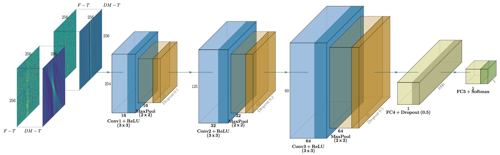

# ska-src-maltopuft-ml

Prototype code for classifying fast radio burst (FRB) candidates detected at the SKA and precursor telescopes.

This repository is currently a fork of [FRBID](https://github.com/Zafiirah13/FRBID), but will eventually be developed into a library for developing new classifiers. 

> FRBID - MeerKAT Fast Radio Burst Intelligent Distinguisher using Deep Learning
>
> Identification of Fast Radio Burst/Single Pulses (FRB/SP) and Radio Frequency Interference (RFI) using Deep Convolutional Neural Network for MeerKAT facility. The code uses two inputs: the DM-Time and Frequency-Time images/arrays. Both images are stacked together and act as an input to a CNN.
>
> 

## Quickstart

Install the requirements in a virtual environment. Note that prototyping is being performed on Mac Silicon and therefore these steps install the `tensorflow-metal`. If you are using a CUDA-enabled GPU, then please ensure your environment is configured correctly before training/evaluating a model. Documentation for configurating in other environments will be added in the future. 

```
python3 -m venv .venv
source .venv/bin/activate
python -m pip install -r requirements.txt
```

Next, train and evaluate the model with the sample data:

```
python train.py
...

python predict.py
...
```
